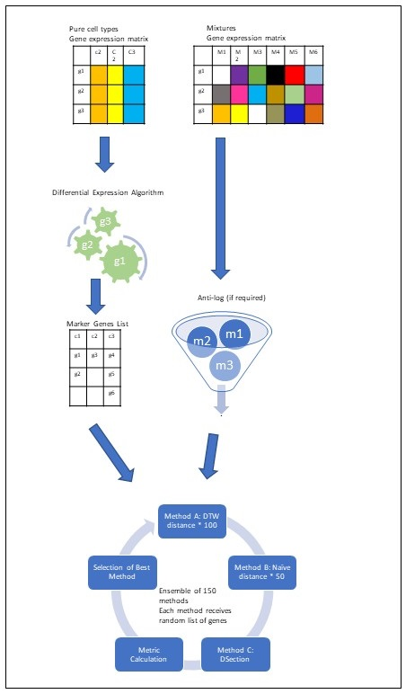

# YADA Deconvolution Package


## Overview
YADA is an innovative biological deconvolution algorithm developed by the author and a collaborator as part of doctoral research in the Systems Biomedicine Lab under the supervision of Professor Efroni. The purpose of YADA is to estimate the proportions of distinct cell types within complex, heterogeneous gene expression samples.

The fundamental premise behind YADA is that the transcriptomic signatures of pure cell populations can be leveraged to deconvolute mixed expression profiles and quantify the relative abundance of each constituent cell type. By analyzing gene expression patterns, deconvolution algorithms computationally unravel the complexities inherent to these cellular mixtures.

YADA implements a robust approach to perform this deconvolution task, accurately estimating immune and other cell type fractions from bulk transcriptomic data. It represents a novel contribution stemming from the author's doctoral studies focused on advancing computational methods for dissecting intricate systems-level biomedical data. Under the guidance of Professor Efroni, the authors were able to design, validate, and optimize YADA to address a crucial need in the field of computational immunology.

## Key Features
YADA implements two approaches for deconvolution:

- Marker-based deconvolution using curated gene signatures representative of each cell type.
- Reference-based deconvolution utilizing a complete gene expression matrix from pure cell populations.

The key features and innovations of YADA include:

- High performance: YADA achieves state-of-the-art accuracy on benchmark datasets, as evidenced by top results in a recent challenge.
- Flexibility: Works with either marker genes or full reference profiles.
- Broad applicability: Core algorithm supports gene expression data from various sequencing platforms.
- Computational efficiency: Optimized parallel implementation allows rapid deconvolution of large datasets.
- User-friendly Python API: One of the few deconvolution libraries natively implemented in Python.

## Installation
Clone this repository using the `git clone` command.

## Training Dataset
The training dataset for YADA comprises benchmark datasets available in the "data" folder. This comprehensive collection includes data from publicly available sources as well as synthetically generated datasets created by the authors. These datasets were utilized for training and validation purposes during the DREAM challenge, a community-based deconvolution benchmarking effort.

## Input File Requirements
The input data for YADA consists of two files:
1. `pure.csv`: A gene expression matrix for purified cell populations, with dimensions `(n_genes) x (k_cell_types)`. For marker-based deconvolution, this file should contain only gene symbols. Refer to the sample notebook for formatting details.
2. `mix.csv`: A gene expression matrix for mixed cell samples, with dimensions `(n_genes) x (m_mixtures)`. The first row must contain mixture labels.
    
Additional guidelines for input files:

- Gene symbols should be provided in the first column for both files.
- It is acceptable for some genes to be missing in either the pure or mixed file.
- Expression data should be in non-log scale. If the maximum expression value is <50, an anti-log transformation is automatically applied.
- YADA performs internal marker gene selection; therefore, not all provided signature genes may be utilized.

By following these specifications, users can ensure their input data is properly formatted for YADA to perform accurate deconvolution.

## Usage
```
from YADA import *

#Marker gene list.
pure_file_path = '../data/xCell/pure.csv'

#This is the mixture file in the format: columns: mix1, mix2, ..., rows: gene names.
mix_file_path = '..data/xCell/mix.csv'
result = run_yada(pure, mix)
```

## Sample Notebooks
- [Using marker gene list](code/YADA.ipynb)
- [Using a complete reference matrix](code/YADA-gene-diff.ipynb)
- [YADA challenge result](data/challenge.ipynb)
- [YADA simulation running](data/sim/readme.md)

## Contributing
We welcome contributions! Please see our Contributing Guidelines for more information on how to get involved.

## License
YADA is available under the MIT license. See the LICENSE file for more details.

## Support
For questions, issues, or feature requests, please open an issue on our GitHub repository.
For additional support, contact: zurkin at yahoo dot com.

## Citation
If you use YADA in your research, please cite our paper:
Livne Dani, Snir Tom, Efroni Sol, YADA - Reference Free Deconvolution of RNA Sequencing Data, Current Bioinformatics; Volume 19, Issue , Year 2024, e050624230728.
DOI: 10.2174/0115748936304034240405034414, https://www.eurekaselect.com/article/140845

## Acknowledgments
We thank the reviewers of this work for their valuable feedback and contributions.

## Resources
### Peer-Reviewed Articles & Preprints
- Accurate estimation of cell-type composition from gene expression data - [Nature Communications](https://www.nature.com/articles/s41467-019-10802-z) 
- ADAPTS: Automated Deconvolution Augmentation of Profiles for Tissue Specific cells - [bioRxiv](https://www.biorxiv.org/content/10.1101/633958v3.full) 
- Automated identification of Cell Types in Single Cell RNA Sequencing - [bioRxiv](https://www.biorxiv.org/content/10.1101/532093v1) 
- CDSeq: A novel complete deconvolution method for dissecting heterogeneous samples - [PLOS Computational Biology](https://journals.plos.org/ploscompbiol/article?id=10.1371/journal.pcbi.1007510) 
- DAISM-DNN: Highly accurate cell type proportion estimation with deep neural networks - [bioRxiv](https://www.biorxiv.org/content/10.1101/2020.03.26.009308v2.full) 
- Deep-learning-based cell composition analysis from tissue expression profiles - [bioRxiv](https://www.biorxiv.org/content/10.1101/659227v2.full) 
- Gene expression inference with deep learning - [PMC](https://www.ncbi.nlm.nih.gov/pmc/articles/PMC4908320/) / [PubMed](https://pubmed.ncbi.nlm.nih.gov/26873929/) 
- Genetic Architect: Discovering Genomic Structure with Learned Neural Architectures - [arXiv](https://arxiv.org/abs/1605.07156) 
- GSVA: gene set variation analysis for microarray and RNA-Seq data - [BMC Bioinformatics](https://bmcbioinformatics.biomedcentral.com/articles/10.1186/1471-2105-14-7) 
- HiG2Vec: hierarchical representations of Gene Ontology and genes in the Poincaré ball - [Bioinformatics](https://academic.oup.com/bioinformatics/article/37/18/2971/6184857) 
- Immune response in silico (IRIS): immune-specific genes identified from microarrays - [Genes & Immunity](https://www.nature.com/articles/6364173) 
- Insights from deconvolution of cell subtype proportions enhance interpretation - [PMC](https://www.ncbi.nlm.nih.gov/pmc/articles/PMC6483354/) 
- MGESP gene signature: A Computational Approach for Immunogenic Features - [PMC](https://www.ncbi.nlm.nih.gov/pmc/articles/PMC6308325/) 
- Profiling tumor infiltrating immune cells with CIBERSORT - [PMC](https://www.ncbi.nlm.nih.gov/pmc/articles/PMC5895181/) 

### Software, Documentation & Tools 
- Omnideconv - [Official Website](https://omnideconv.org/) 
- Analyzing RNA-seq data with DESeq2 [Bioconductor Vignette](http://bioconductor.org/packages/release/bioc/vignettes/DESeq2/inst/doc/DESeq2.html) 
- edgeR: differential expression analysis of digital gene expression data - [PMC](https://www.ncbi.nlm.nih.gov/pmc/articles/PMC2796818/) 
- UNDO: Unsupervised deconvolution of mixed gene expression in tumor samples - [Mendeley / Bioconductor](https://www.mendeley.com/catalogue/2678168f-9486-371e-b755-da240a398171/) 

### Technical Tutorials & Discussions 
- Comparing Distance Measurements with Python and SciPy - [KDnuggets](https://www.kdnuggets.com/2017/08/comparing-distance-measurements-python-scipy.html) 
- Computational Geometry in Python: From Theory to Application - [Toptal](https://www.toptal.com/python/computational-geometry-in-python-from-theory-to-implementation) 
- Comparing normalization methods for Illumina RNA-Seq data - [PMC](https://www.ncbi.nlm.nih.gov/pmc/articles/PMC4625728/) 
- Deconvolution Methods on RNA-Seq Data (Mixed cell types) - [Biostars Discussion](https://www.biostars.org/p/160961/#237546)

- Matrix decomposition https://en.wikipedia.org/wiki/Matrix_decomposition
- Collection of papers https://github.com/changwn/Deconvolution_paper
